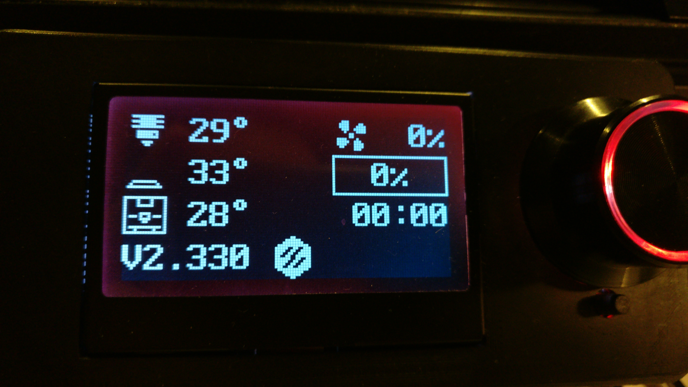
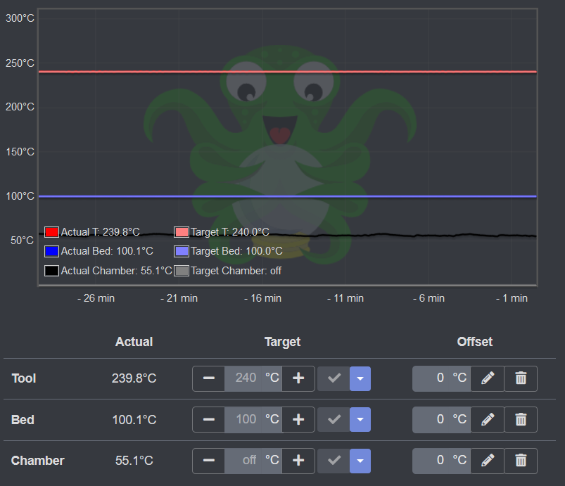

# LCD Chamber Temperature
This guide walks you through modifying the Klipper LCD layout in order to display chamber temperature as below:



Major thanks to **aMpeX** for putting in the Klipper PR to make this so easy!

## **INSTRUCTIONS**
**FIRST** Update Klipper. This guide relies on features merged on *June 8, 2020*.

## 0. [Optional] Create a new `.cfg` file for all things LCD-related
While you can skip this step, creating purpose-oriented `.cfg` files allows you to keep all related configuration items, macros, etc. in one easy to find place and keeps your `printer.cfg` from becoming cluttered and unwieldly.
1) Create a new file called `lcd_tweaks.cfg` in the same directory as `printer.cfg`
2) Link this file to your configuration by adding `[include lcd_tweaks.cfg]` to `printer.cfg`

## 1. Define the chamber temperature probe
There are several ways to do this. I don't have mine linked to an exhaust fan, etc, so mine looks like this. 

In `printer.cfg`:
```ini
[temperature_sensor chamber]
sensor_type: NTC 100K beta 3950
sensor_pin: z:P0.24
min_temp: 0
max_temp: 100
gcode_id: C
```
If you've already defined a chamber sensor, or a temperature fan linked to the chamber, make note of the full configuration section name.

## 2. Define the chamber glyph/icon
Here you tell Klipper what you want the `chamber` icon to look like.

Add the following section to `lcd_tweaks.cfg`:
```py
[display_glyph chamber]
data:
	................
    ****************
    *....*....*....*
    *....*....*....*
    *....******....*
    *..............*
    *..............*
    *.....****.....*
    *.***.*..*.***.*
    *.....****.....*
    *......**......*
    *..............*
    *.************.*
    *...*......*...*
    ****************
    ................
 ```
 Multiple custom glyphs/icons can be defined this way. We'll also define the Voron logo glyph for the serial status display line:
 ```py
[display_glyph voron]
data:
    .......**.......
    .....******.....
    ....********....
    ..************..
    .*****..**..***.
    .****..**..****.
    .***..**..*****.
    .**..**..******.
    .******..**..**.
    .*****..**..***.
    .****..**..****.
    .***..**..*****.
    ..************..
    ....********....
    .....******.....
    .......**.......
 ```

## 3. Define the display layout and data fields
Define the custom 'Voron' `display_data` group by adding the following to your `lcd_tweaks.cfg`:
```ini
[display_template _vheater_temperature]
param_heater_name: "extruder"
text:
  
    
    # Show glyph
    
      
        {% set frame = (printer.toolhead.estimated_print_time|int % 2) + 1 %}
        ~bed_heat{frame}~
      
        ~bed~
      
    
      ~extruder~
    
    # Show temperature
    { "%3.0f" % (heater.temperature,) }
    # Optionally show target
    
      ~right_arrow~
      { "%0.0f" % (heater.target,) }
    
    ~degrees~
  

[display_data __voron_display extruder]
position: 0, 0
text: { render("_vheater_temperature", param_heater_name="extruder") }

[display_data __voron_display fan]
position: 0, 10
text:
  
    
    
      {% set frame = (printer.toolhead.estimated_print_time|int % 2) + 1 %}
      ~fan{frame}~
    
      ~fan1~
    
    { "{:>4.0%}".format(speed) }
  

[display_data __voron_display bed]
position: 1, 0
text: { render("_vheater_temperature", param_heater_name="heater_bed") }

[display_data __voron_display progress_text]
position: 1, 10
text:
  
  { "{:^6.0%}".format(progress) }
  
[display_data __voron_display progress_text2]
position: 1, 10
text:
  
  { draw_progress_bar(1, 10, 6, progress) }

[display_data __voron_display printing_time]
position: 2, 10
text:
  
  { "%02d:%02d" % (ptime // (60 * 60), (ptime // 60) % 60) }

#########################################################
# This section defines the actual chamber temp. field,
# replace 'temperature_sensor chamber' as necessary
#########################################################
[display_data __voron_display chamber]
position: 2, 0
text:
  
	~chamber~
	{ "%3.0f" % (chamber.temperature,) }
	~degrees~

[display_data __voron_display print_status]
position: 3, 0
text: 
  
    { printer.display_status.message }
  
    
    { "X%-4.0fY%-4.0fZ%-5.2f" % (pos.x, pos.y, pos.z) }
  
    { "VX.xxx " }
	~voron~
  
  ```

**IMPORTANT NOTE**
Regarding the use of `temperature_fan`: You'll need to replace `['temperature_sensor chamber']` in the 2nd-to-last section above with `['tempaure_fan chamber']`, or whatever you've actually defined that section config section as. Likewise if you've named your sensor anything other than 'chamber'.

Tell Klipper you want to use the group we just defined by adding the following setting to your `[Display]` section in `printer.cfg`:
```
display_group: __voron_display
```
Lastly, save the changes you've made to `printer.cfg` and `lcd_tweaks.cfg` and perform a firmware restart.

## 4. [Optional] Enable Chamber Temp. Display in OctoPrint
To show the chamber temperature on the temperature plot in OctoPrint:

In `Octoprint Settings` -> `Printer Profiles` -> `Edit Profile` (pencil icon) -> `Print bed & build volume`, tick the `Heated Chamber` box.



## DONE!
God-willing, after all that, you should see your chamber temp on the display :)
