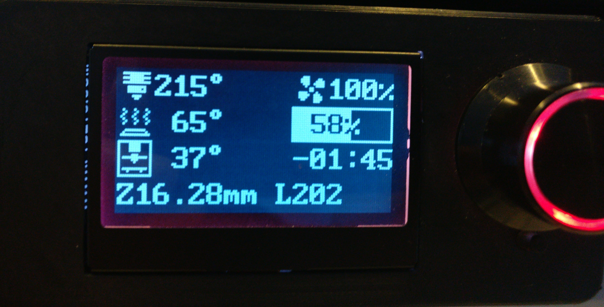

# LCD Chamber Temperature
This guide details the Klipper modifications I used to display a chamber temperature readout on your graphical LCD screen.



### Notes
* All modified files are included in full in the `/modded_files` for refence/context only
* The bitmap image used to generate the chamber icon can be found in the `/images` folder
* **PLEASE** backup all of the files modified in this guide before saving any changes!
* Thanks to **aMpeX** for helping me figure this out

## 1. Define the chamber glyph/icon
Here you tell Klipper what you want the `chamber` icon to look like.
Make the following modifications to the `klipper\klippy\extras\display\icons.py` file
1) Define the `chamber_icon` array. Insert the following after the `feedrate_icon` array:
```py
chamber_icon = [
    0b1111111111111111,
    0b1000011111000011,
    0b1000011111000011,
    0b1000011111000011,
    0b1000011111000011,
    0b1000000000000011,
    0b1000001110000011,
    0b1011111111111011,
    0b1000001110000011,
    0b1000000100000011,
    0b1000000000000011,
    0b1000000000000011,
    0b1011111111111011,
    0b1000100000100011,
    0b1000000000000011,
    0b1111111111111111
 ]
 ```
2) Add the `chamber_icon` array to the `Icons16x16` dictionary at the end of the file, like so:
```py
Icons16x16 = {
    'extruder': extruder_icon,
    'bed': bed_icon, 'bed_heat1': bed_heat1_icon, 'bed_heat2': bed_heat2_icon,
    'fan': fan1_icon, 'fan1': fan1_icon, 'fan2': fan2_icon,
    'feedrate': feedrate_icon,
    'chamber': chamber_icon,
}
```
3) Save changes

## 2. Define the chamber temperature probe
There are several ways to do this. I don't have mine linked to an exhaust fan, etc, so mine looks like this. 

In `printer.cfg`:
```ini
[temperature_sensor chamber]
sensor_type: NTC 100K beta 3950
sensor_pin: z:P0.24
min_temp: 0
max_temp: 100
gcode_id: C
```
## 3. Define the display layout/fields
1) Define the `display_data` group by adding the following to your `printer.cfg`, or defining it in a linked file:
```ini
[display_template _vheater_temperature]
param_heater_name: "extruder"
text:
  
    
    # Show glyph
    
      
        ~animated_bed~
      
        ~bed~
      
    
      ~extruder~
    
    # Show temperature
    { "%3.0f" % (heater.temperature,) }
    # Optionally show target
    
      ~right_arrow~
      { "%0.0f" % (heater.target,) }
    
    ~degrees~
  

[display_data __voron_display extruder]
position: 0, 0
text: { render("_vheater_temperature", param_heater_name="extruder") }

[display_data __voron_display fan]
position: 0, 10
text:
  
    
      ~fan~
    { "{:>4.0%}".format(speed) }
  

[display_data __voron_display bed]
position: 1, 0
text: { render("_vheater_temperature", param_heater_name="heater_bed") }

[display_data __voron_display progress_text]
position: 1, 10
text:
  
  { "{:^6.0%}".format(progress) }
  
[display_data __voron_display progress_text2]
position: 1, 10
text:
  
  { draw_progress_bar(1, 10, 6, progress) }

[display_data __voron_display printing_time]
position: 2, 10
text:
  
  
  {% if progress >= 0.05 and ptime % 12 >= 6 %}
    # Periodically show time remaining
    
    { "-%02d:%02d" % (rtime // (60 * 60), (rtime // 60) % 60) }
  
    {% set msg = "%02d:%02d" % (ptime // (60 * 60), (ptime // 60) % 60) %}
    { "%6s" % (msg,) }
  

[display_data __voron_display print_status]
position: 3, 0
text: 
  
    { printer.display_status.message }
  
    
    { "X%-4.0fY%-4.0fZ%-5.2f" % (pos.x, pos.y, pos.z) }
  
    Ready
  
  ```

  The next bit defines the chamber temp. display section. Be sure to change `temperature_sensor chamber` to whatever your sensor was actually defined as in Section 1 (keep the quotation marks!). Throw this in with the above once you've confirmed that:
  ```ini
  [display_data __voron_display chamber]
position: 2, 0
text:
  
	~chamber~
	{ "%3.0f" % (chamber.temperature,) }
	~degrees~
```
2) Tell Klipper you want to use the group we just defined by adding the following line your `[Display]` section in `printer.cfg`:
```
display_group: __voron_display
```
3) Save the changes you've made to `printer.cfg`.

4) Restart the Klipper service from the SSH terminal: `sudo service klipper restart`

## DONE!
God-willing, after all that, you should see your chamber temp on the display :)